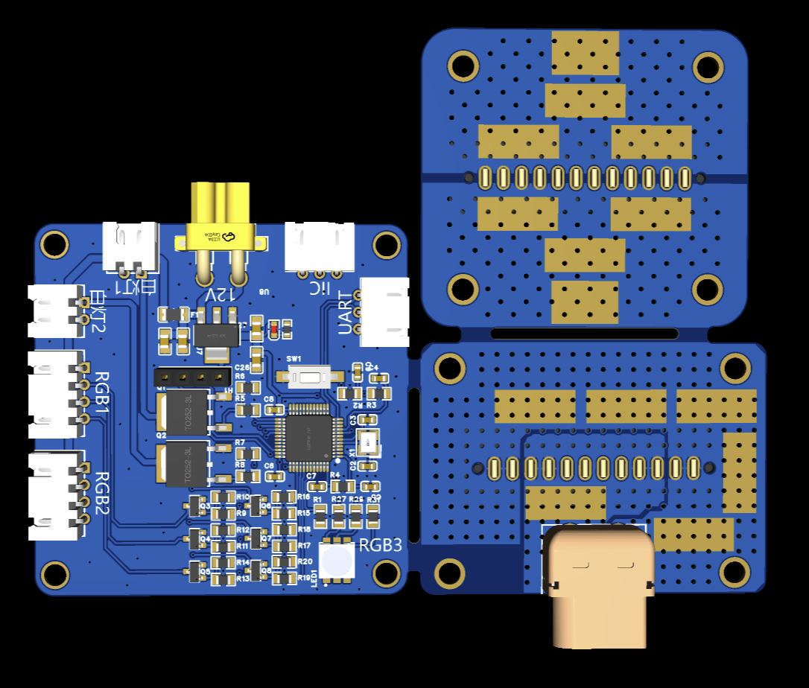
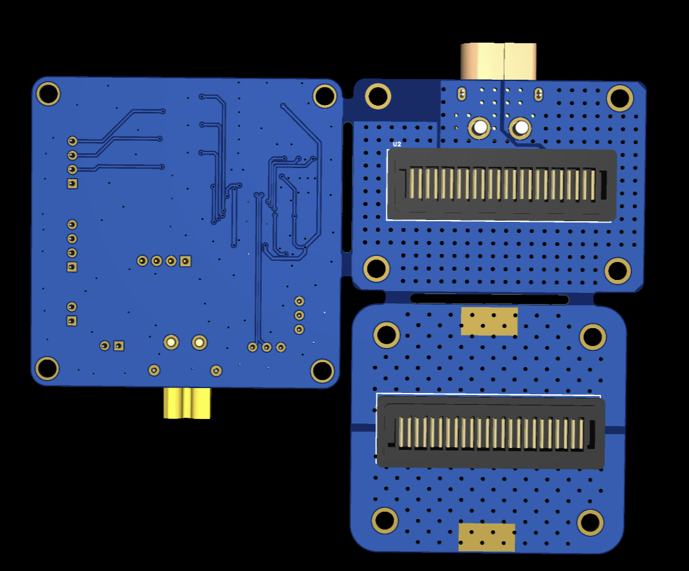
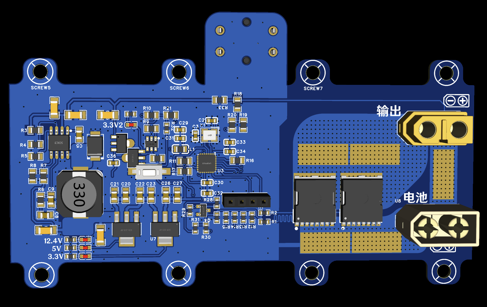
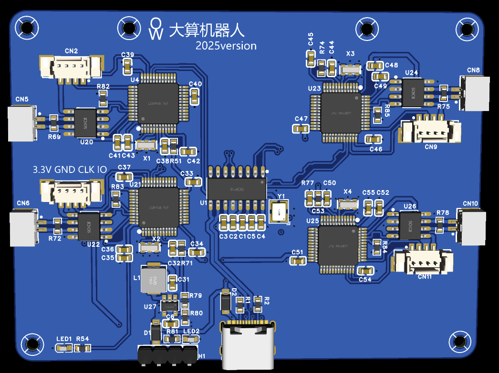

## 目录结构

- **epro/** - EasyEDA Pro 工程文件
- **renders/** - 电路板渲染图

## 电路板介绍

### 1. 电源接口和LED驱动板

控制LED指示灯和电源分配。

### 2. 电池仓开关板

电池电量监测和电源管理。

### 3. 通信控制板

系统核心控制板，负责通信协议和整体控制逻辑。

### 4. 四路PCAN板转USB

提供4个独立的CAN总线通道，用于与电机和主板通信。

## 说明

- 使用 **嘉立创EDA** 打开和编辑工程文件
- 固件代码见 `../firmmware/` 目录